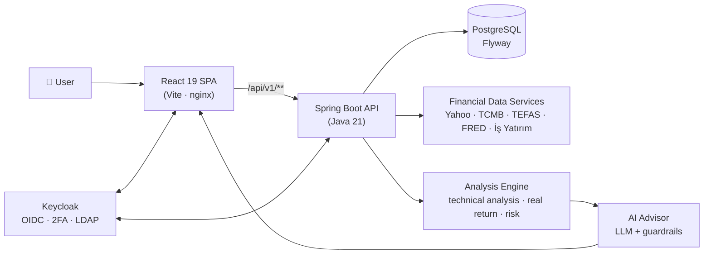
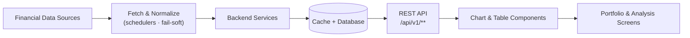
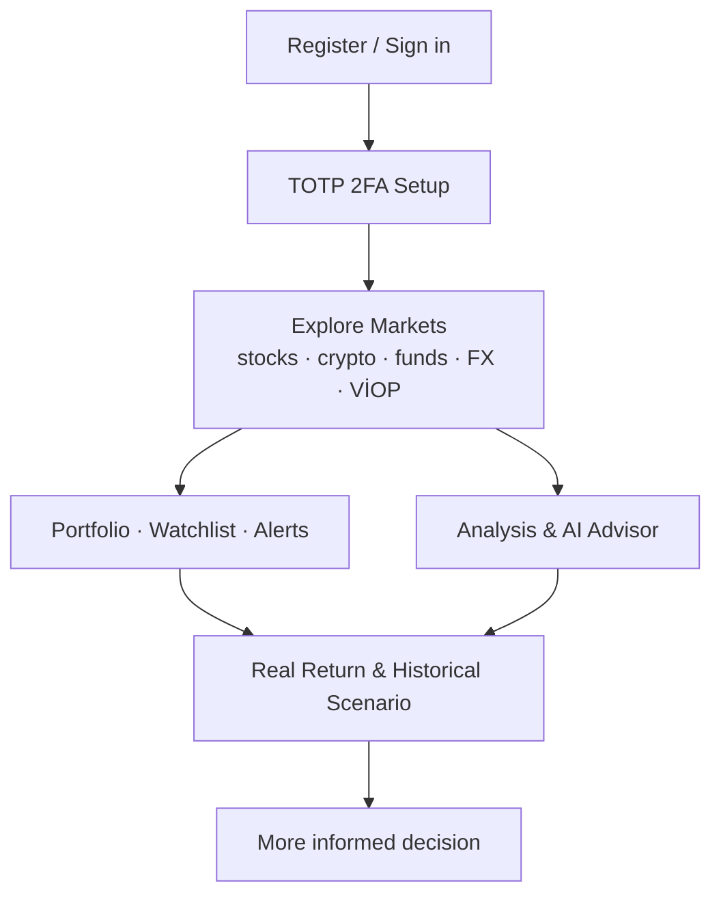

<div align="center">

# 📈 Finance Portal

**An institutional-grade, single-screen finance desk for individual investors.**

Stocks · Crypto · FX · Commodities · Mutual Funds · Bonds/Bills · VİOP (Futures) · Inflation · News · Portfolio — _all in one modern interface._

[](https://openjdk.org/projects/jdk/21/)
[](https://spring.io/projects/spring-boot)
[](https://react.dev/)
[](https://vite.dev/)
[](https://docs.docker.com/compose/)
[](https://kubernetes.io/)
[](https://www.keycloak.org/)
[](#-license)

[🇹🇷 Türkçe](README.md) · **🇬🇧 English**

</div>

> ⚠️ **Important:** All buy/sell actions — especially **bonds/bills and VİOP** — are **simulations.** No real order is ever sent; they exist for portfolio tracking and education only. Nothing here is **investment advice.**

---

## 📑 Table of Contents

[About](#-about) ·
[Problem Solved](#-problem-solved) ·
[Key Features](#-key-features) ·
[Modules](#-feature-by-feature-modules) ·
[Tech Stack](#️-tech-stack) ·
[System Architecture](#️-system-architecture) ·
[Setup](#-setup) ·
[Docker](#-run-with-docker) ·
[Environment Variables](#️-environment-variables) ·
[Tests & Quality](#-tests--code-quality) ·
[Security](#-security-approach) ·
[AI Advisor](#-ai-advisor-approach) ·
[Roadmap](#️-roadmap) ·
[Contributors](#-contributors) ·
[License](#-license)

---

## 🖼️ Screenshots

<p align="center">
  
</p>

<p align="center">
  
</p>

<p align="center">
  
</p>

<p align="center">
  
</p>

---

## 🔭 About

**Finance Portal** unifies the scattered financial-data experience of individual investors into **one modern web interface.** Stocks, crypto, FX, commodities, mutual funds, bonds/bills, VİOP, inflation, news and a personal portfolio — all on the same screen, in one consistent language.

But Finance Portal doesn't just **show** data; it **makes sense of it.** With inflation-adjusted **real return**, **risk/signal** assessments, **AI-assisted analysis**, **portfolio performance** and **historical scenario** calculations, it provides genuine decision support.

> **Vision:** Put an institutional-grade finance desk in every individual investor's pocket.

**Target users:** individual & beginner investors · active market followers · long-term investors · anyone who wants to manage their portfolio in one place.

---

## 🎯 Problem Solved

| Problem | Finance Portal's approach |
|---|---|
| Data is **scattered** — prices on one site, funds on another, inflation elsewhere | Multi-asset data **gathered and normalized on one screen** |
| **Nominal returns mislead** — a "winning" position may be losing in real terms | An **inflation-adjusted real return** for every gain |
| **Missing context** when deciding | Risk level, short/long-term signals and an **AI advisor** |
| The "**I wish I'd bought back then**" question | A **historical scenario** engine: the real outcome today of a past purchase |
| Tracking is **tedious** | Personal watchlists, **price alerts** and notifications |

> **Core idea:** an inflation-aware decision-support tool that clearly answers "Did I gain nominally, or did I really gain?"

---

## ✨ Key Features

- 🧮 **Multi-asset market tracking** — BIST & US stocks, crypto, FX, commodities, funds, bonds/bills, VİOP; searchable/sortable tables, mini trend charts.
- 📊 **Professional charts** — candlesticks, moving averages, volume, MACD, RSI, drawing tools, multiple timeframes.
- 📉 **Inflation & real return** — Türkiye CPI + US CPI; the inflation-adjusted real return of investments.
- 💼 **Portfolio management** — tabbed view (All / Stocks / VİOP / Bonds), average cost, P/L, allocation, performance, **buy/sell transaction history**, **closed-position (realized) P/L chart**, bulk Excel import.
- 🕰️ **Historical scenario** — "What if I had bought Y on date X?" (nominal + real).
- 🤖 **AI advisor** — finance-focused chat; never promises guaranteed returns, never issues direct buy/sell orders, always includes a disclaimer.
- 🔔 **Watchlists & alerts** — target-price alerts, in-app + email notifications.
- 🌗 **Personalization** — light/dark/system theme, TR/EN language, currency preference (Original / ₺ / $).
- 🔐 **Strong identity** — Keycloak OIDC + mandatory TOTP 2FA + LDAP federation.
- 📰 **Multi-source news** — categorized financial news; automatic Turkish translation of English articles.

---

## 🧩 Feature-by-Feature Modules

<details open>
<summary><b>1. Home</b></summary>

Market overview · top movers of the day · featured BIST 100 stocks · FX ticker · latest financial news · quick-access cards.
</details>

<details>
<summary><b>2. Stocks, Crypto & Commodities</b></summary>

BIST & US stocks · cryptocurrencies · commodities such as gold, silver, oil, natural gas, copper · searchable/sortable tables · mini trend charts · detailed price chart · technical indicators · currency selection (Original / TL / USD).
</details>

<details>
<summary><b>3. Detailed Chart</b></summary>

Candlestick chart · moving averages · volume · MACD · RSI · drawing tools · multiple timeframes.
</details>

<details>
<summary><b>4. Mutual Funds</b></summary>

Turkish mutual funds · unit price · daily/monthly/yearly/3-year/5-year returns · risk level · fund comparison.
</details>

<details>
<summary><b>5. Bonds & Bills</b></summary>

Government bonds · treasury bills · maturity, coupon, price and yield (YTM) · deposit rates · yield-history chart. Buy/sell is modeled as a **simulation** (nominal, clean/dirty price, weighted-average cost, coupon, redemption).
</details>

<details>
<summary><b>6. FX</b></summary>

TCMB exchange rates · buy, sell and effective rates · instant currency converter.
</details>

<details>
<summary><b>7. VİOP (Futures)</b></summary>

Borsa İstanbul futures contracts · underlying · maturity · last price · volume · a **simulation** built on long/short position logic (contract size, category-based margin, leverage, net position, expiry).
</details>

<details>
<summary><b>8. Inflation & Real Return</b></summary>

Türkiye CPI + US CPI · monthly/yearly charts · 5-year cumulative view · inflation-adjusted real return of investments · answering "Did I gain nominally, or did I really gain?"
</details>

<details>
<summary><b>9. News</b></summary>

Multi-source financial news · economy/stocks/FX/crypto/commodities categories · automatic Turkish translation of English articles · article detail page and source link.
</details>

<details>
<summary><b>10. Analysis & AI Advisor</b></summary>

Cross-asset analysis table · daily/weekly/monthly/yearly change · real yearly return · risk level · short/long-term signals · "Beats inflation" filter · AI-assisted chat advisor.
_Example questions:_ "How can I invest 5,000 TL?" · "How is gold this month?" · "What are some low-risk investment ideas?"
</details>

<details>
<summary><b>11. My Portfolio</b></summary>

Add your own positions · total portfolio value · total P/L · allocation chart · average-cost calculation · bulk Excel import. **Tabbed view** (All / Stocks-Crypto-Funds / VİOP / Bonds-Bills), **buy/sell transaction history** and a **closed-position (realized) profit/loss chart**.
</details>

<details>
<summary><b>12. Historical / Past Scenario</b></summary>

"What if I had bought Y on date X?" · today's value · P/L · inflation-adjusted real return · a **value-over-time chart** of your positions (1M / 3M / 1Y / All) · bulk Excel import.
</details>

<details>
<summary><b>13. Watchlists, Alerts & Settings</b></summary>

Personal watchlists · target-price alerts · in-app + email notifications · light/dark/system theme · language selection · currency preference · profile and security settings · 2FA support.
</details>

---

## 🛠️ Tech Stack

### Backend
- **Java 21**, **Spring Boot 3.5.9**, Maven (wrapper)
- **REST API** (`/api/v1/**`) · layered architecture (`controller → service → repository → entity/dto`)
- **Spring Security** — OAuth2 Resource Server, **JWT (RS256)** authentication (Keycloak)
- **Spring Data JPA / Hibernate** + **PostgreSQL** · versioned schema migrations with **Flyway**
- **Caffeine** cache · **ShedLock** (distributed scheduler lock) · scheduled data-refresh jobs
- Helpers: **springdoc-openapi** (Swagger UI), **Jsoup** (HTML scraping), **Apache POI** (Excel)

### Frontend
- **React 19** + **Vite 7** (`@vitejs/plugin-react-swc`) — **JavaScript / JSX**
- Modern **dashboard UI** · **responsive** design
- **react-router** · **axios** · **keycloak-js** (OIDC/PKCE)
- Chart & table components: **lightweight-charts**, **klinecharts** (candles + drawing + indicators), **recharts**
- **Tailwind CSS** · custom **i18n** (TR/EN) · CSS-variable **theming** · multi-**currency** display

### DevOps / Quality / Observability
- **Docker** & **Docker Compose** (fully self-hosted stack) · **Kubernetes + Kustomize** (base + dev/prod/gke overlays)
- **CI/CD:** **GitHub Actions** (build + test) · **Google Cloud (GKE)** deployment pipeline _(deploy step manual/paused — for cost control)_
- Code quality: **SonarCloud** + **JaCoCo** (test coverage)
- Observability: **Prometheus** + **Grafana** (metrics) · **OpenTelemetry** + **Jaeger** (tracing) · centralized log pipeline (Log4j2 → Kafka → OpenSearch)
- Identity infrastructure: **Keycloak 26** + **OpenLDAP**

> ℹ️ The codebase is written in **JavaScript/JSX** (no TypeScript). Exact versions and per-service details live in the developer notes inside the repo.

---

## 🏗️ System Architecture

### Overall system flow



### Data flow



### User flow



> The architecture follows a classic **layered / clean architecture** approach: calculation logic is isolated into pure, testable services; all write endpoints are authenticated (the user comes from the JWT `sub` claim, and everyone can only access their own data).

---

## 🚀 Setup

### Requirements
- **Docker Desktop** (Compose v2) — 8 GB+ RAM recommended
- _(For Docker-free local development only)_ **JDK 21** and **Node 20**

### Clone the repo

```bash
git clone <repo-url>
cd finans-portali
```

Indicative repo layout:

```text
finans-portali/
├── backend/            # Spring Boot (Java 21) — REST API, services, schedulers
├── frontend/           # React 19 + Vite (JavaScript/JSX) — SPA
├── k8s/                # Kubernetes + Kustomize (base + overlays)
├── docs/               # Docs, screenshots
├── scripts/            # Helper scripts (make.ps1, keycloak-bootstrap.sh, ...)
├── docker-compose.yml
├── .env.example
└── README.md
```

---

## 🐳 Run with Docker

```bash
# 1) Create the environment file (REQUIRED first step)
cp .env.example .env            # Windows (PowerShell): Copy-Item .env.example .env

# 2) Bring the whole stack up
docker compose up -d
```

> The stack starts cleanly with default values. The first start may take a few minutes due to image builds and Keycloak/infrastructure boot.

After startup:

| Service | Address |
|---|---|
| **App (Frontend)** | http://localhost |
| **Backend API** | http://localhost:8080 |
| **API Docs (Swagger)** | http://localhost:8080/swagger-ui.html |
| **Health check** | http://localhost:8080/actuator/health |
| **Keycloak (identity)** | http://localhost:8090 |

**First sign-in:** create an account with **Register** in the app (self-registration is open). **TOTP 2FA** setup is mandatory on first login (Google Authenticator / FreeOTP).

> Stop with `docker compose down` · wipe all data with `docker compose down -v`.

---

## ⚙️ Environment Variables

`.env` is copied from `.env.example` (gitignored). Core variables ship with defaults; **features that need external data/keys are optional** — leave one empty and only that feature is disabled, the app still runs.

| Variable | Description | Required? |
|---|---|---|
| `POSTGRES_DB` / `POSTGRES_USER` / `POSTGRES_PASSWORD` | Database credentials | ✅ (has defaults) |
| `KEYCLOAK_ADMIN` / `KEYCLOAK_ADMIN_PASSWORD` | Keycloak admin console | ✅ (has defaults) |
| `KC_BACKEND_CLIENT_SECRET` | Backend → Keycloak Admin API client secret | ✅ (has defaults) |
| `BACKEND_PORT` / `POSTGRES_PORT` | Host ports (change on conflict) | Optional |
| `EVDS_API_KEY` | TCMB EVDS3 (bonds, TR inflation, deposit rates) | Optional |
| `APP_FRED_API_KEY` | FRED (US CPI / US inflation) | Optional |
| `GMAIL_SMTP_USERNAME` / `GMAIL_SMTP_APP_PASSWORD` | Email notifications (Gmail App Password) | Optional |
| `APP_LLM_API_KEY` | AI advisor (OpenAI-compatible LLM) | Optional |

> 🔐 Values in `.env` are **for development only**; always change them in production. Real secrets are never committed.

---

## 🧪 Tests & Code Quality

```bash
# Backend — unit/integration tests + coverage report (JaCoCo)
cd backend && ./mvnw test          # report: target/site/jacoco/index.html

# Frontend — production build
cd frontend && npm install && npm run build
```

- **Unit tests** pin the financial-calculation services (portfolio, bonds, VİOP, inflation) against spec examples.
- **Integration tests** exercise the controllers with `@WebMvcTest` + MockMvc + JWT (routing, auth, validation).
- **JaCoCo** reports coverage; **SonarCloud** applies static analysis and a quality gate.
- **GitHub Actions** runs backend `verify` + frontend `build` on every PR and `main` push.

---

## 🔐 Security Approach

- **Keycloak OIDC** — `finans` realm; public (PKCE) frontend client + confidential backend service-account.
- **JWT (RS256)** — Spring Security **stateless OAuth2 Resource Server**; the user identity always comes from the token (`sub`).
- **RBAC** — `USER` / `ADMIN` realm roles; role-based endpoint protection (`@EnableMethodSecurity`).
- **Mandatory TOTP 2FA** — every user sets up two-factor authentication on first login.
- **LDAP federation** — OpenLDAP users authenticate through Keycloak; group → role mapping supported.
- **Password policy** — length + upper/lower/digit rules; **brute-force** protection.
- **Data isolation** — users can only access their own portfolio/alert/watchlist data.
- **Logging security** — sanitization against log injection (CRLF) + correlation IDs.

> ⚠️ The default credentials and relaxed settings in the repo (e.g. development-only actuator endpoints) are **for development only** and must be hardened before production.

---

## 🤖 AI Advisor Approach

The AI advisor provides financial **decision support** — but with deliberate limits:

- ❌ **Never promises guaranteed returns.**
- ❌ **Never issues direct buy/sell orders.**
- ✅ Every answer carries a **"not investment advice"** disclaimer.
- ✅ Answers are grounded in portfolio context, real return, risk level and market data.
- ✅ If no LLM key is configured, the advisor runs in a **local/fallback mode** without sending real personal data out.

> The goal is not to steer the user but to **inform** them — transparently answering "what, why, and at what risk?"

---

## 🗺️ Roadmap

- [x] **Category-based** VİOP margin/leverage (index/stock/FX/metal) + per-contract margin infrastructure
- [ ] Real exchange/Takasbank **margin parameters** feed (to populate per-contract margins with live data)
- [x] Bond coupon **withholding tax** (by type + holding period) and **automatic accrued interest** (ACT/ACT)
- [ ] **Automatic** withholding-rate updates per current regulation
- [ ] Richer **portfolio analytics** (return attribution, diversification score)
- [ ] Deeper **mobile** experience (PWA)
- [ ] **Tool-calling** for the AI advisor (justification with live data)
- [ ] Expanded **international market** coverage

> The roadmap is reprioritized over time; suggestions and contributions are very welcome.

---

## 👤 Contributors

| | |
|---|---|
| **Yiğit Şeker** | Design & development (full-stack) |

To contribute: open an **issue**, or follow the **fork → branch → pull request** flow. Feedback and improvement ideas are valued.

---

## 📄 License

This project is licensed under the **MIT License**. See the `LICENSE` file for details.

---

<div align="center">

**Finance Portal** — _it doesn't just show data, it makes sense of it._

⭐ If you like the project, don't forget to star it.

</div>
