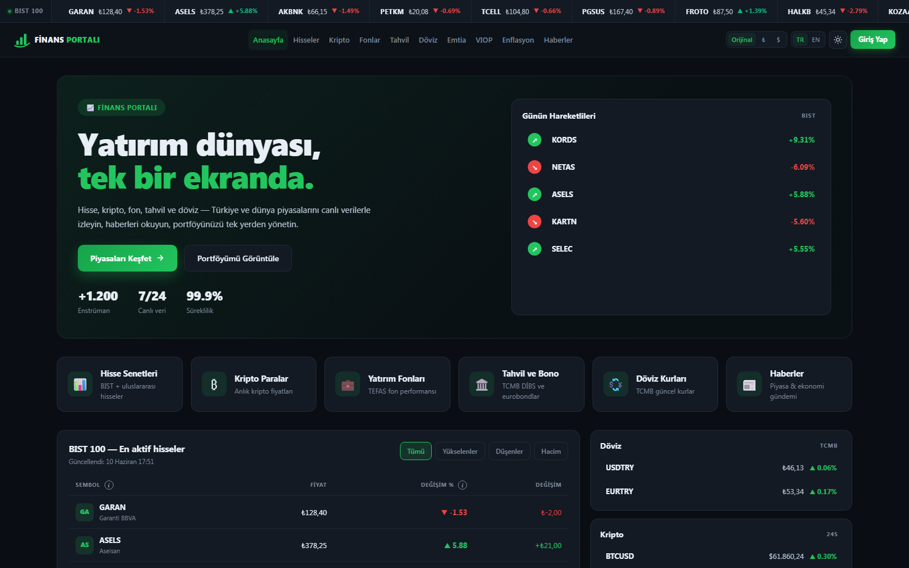
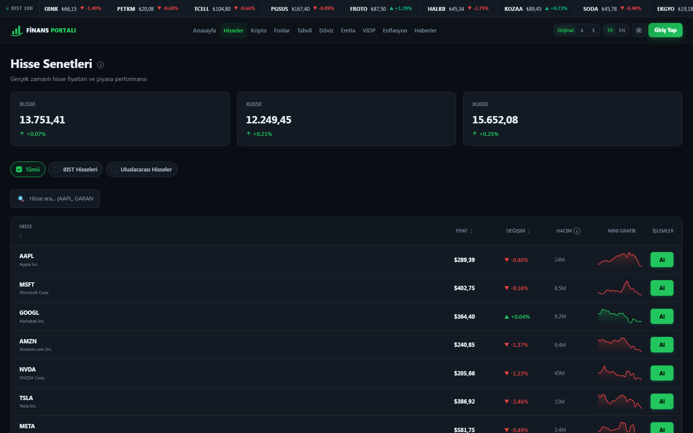
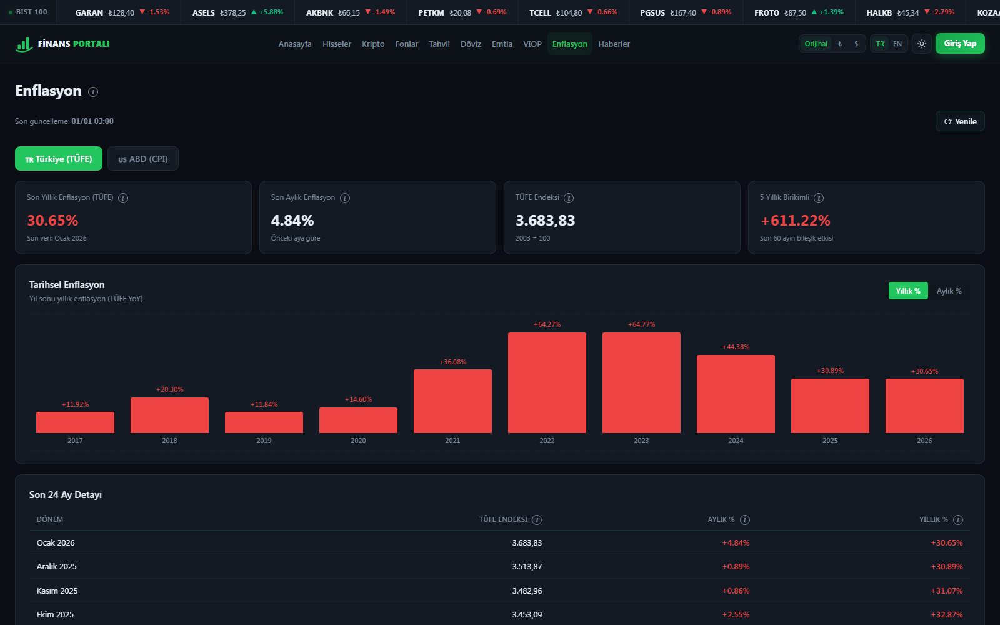
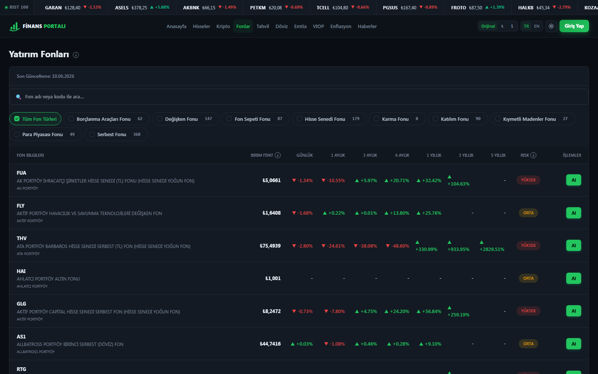
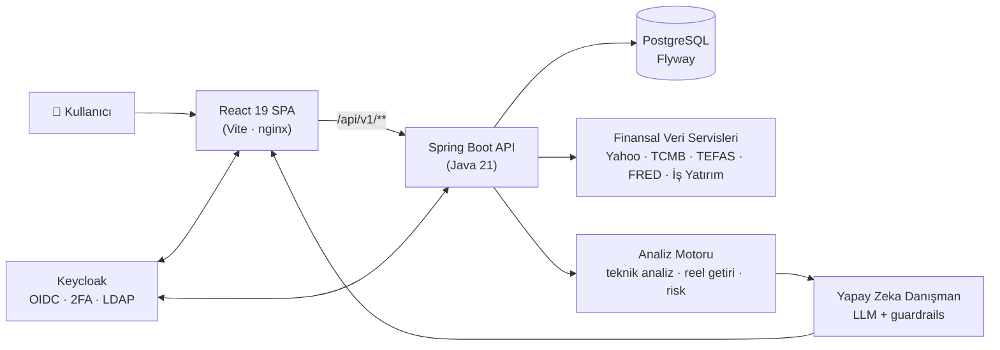
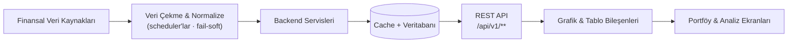
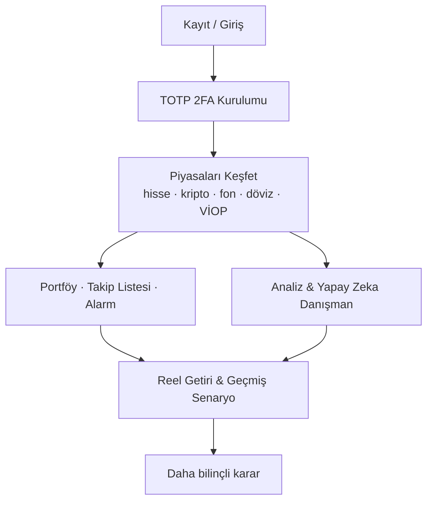

<div align="center">

# 📈 Finans Portalı

**Bireysel yatırımcılar için, kurumsal kalitede tek ekran finans masası.**

Hisse · Kripto · Döviz · Emtia · Yatırım Fonu · Tahvil/Bono · VİOP · Enflasyon · Haberler · Portföy — _hepsi tek, modern bir arayüzde._

[](https://openjdk.org/projects/jdk/21/)
[](https://spring.io/projects/spring-boot)
[](https://react.dev/)
[](https://vite.dev/)
[](https://docs.docker.com/compose/)
[](https://kubernetes.io/)
[](https://www.keycloak.org/)
[](#-lisans)

**🇹🇷 Türkçe** · [🇬🇧 English](README.en.md)

</div>

> ⚠️ **Önemli:** Tüm al-sat işlemleri — özellikle **tahvil/bono ve VİOP** — **simülasyondur.** Gerçek emir gönderilmez; yalnızca portföy takibi ve eğitim amaçlıdır. Hiçbir içerik **yatırım tavsiyesi değildir.**

---

## 📑 İçindekiler

[Proje Hakkında](#-proje-hakkında) ·
[Çözülen Problem](#-çözülen-problem) ·
[Temel Özellikler](#-temel-özellikler) ·
[Modüller](#-modül-modül-özellikler) ·
[Teknoloji Yığını](#️-teknoloji-yığını) ·
[Sistem Mimarisi](#️-sistem-mimarisi) ·
[Kurulum](#-kurulum) ·
[Docker](#-docker-ile-çalıştırma) ·
[Ortam Değişkenleri](#️-ortam-değişkenleri) ·
[Test & Kalite](#-test-ve-kod-kalitesi) ·
[Güvenlik](#-güvenlik-yaklaşımı) ·
[Yapay Zeka Danışman](#-yapay-zeka-danışman-yaklaşımı) ·
[Yol Haritası](#️-yol-haritası) ·
[Katkı](#-katkıda-bulunanlar) ·
[Lisans](#-lisans)

---

## 🖼️ Ekran Görüntüleri

<p align="center">
  
</p>

<p align="center">
  
  
</p>

<p align="center">
  
</p>

---

## 🔭 Proje Hakkında

**Finans Portalı**, bireysel yatırımcıların dağınık finansal veri deneyimini **tek bir modern web arayüzünde** birleştiren bir platformdur. Hisse senedi, kripto para, döviz, emtia, yatırım fonu, tahvil/bono, VİOP, enflasyon, haberler ve kişisel portföy — hepsi aynı ekranda, tutarlı bir dille sunulur.

Ancak Finans Portalı yalnızca **veri gösteren** bir platform değildir; veriyi **anlamlandırır.** Enflasyondan arındırılmış **reel getiri**, **risk/sinyal** değerlendirmeleri, **yapay zeka destekli analiz**, **portföy performansı** ve **geçmiş senaryo** hesaplamalarıyla kullanıcıya finansal karar desteği sunar.

> **Vizyon:** Her bireysel yatırımcının cebinde, kurumsal kalitede bir finans masası oluşturmak.

**Hedef kullanıcılar:** bireysel ve yeni başlayan yatırımcılar · aktif piyasa takipçileri · uzun vadeli yatırımcılar · portföyünü tek yerden yönetmek isteyenler.

---

## 🎯 Çözülen Problem

| Sorun | Finans Portalı'nın yaklaşımı |
|---|---|
| Veri **dağınık** — fiyatlar bir sitede, fon bir başka, enflasyon ayrı | Çok-varlıklı verinin **tek ekranda** toplanması ve normalize edilmesi |
| **Nominal getiri yanıltıcı** — "kazandım" sanılan pozisyon reelde kayıpta olabilir | Her getiri için **enflasyondan arındırılmış reel getiri** hesabı |
| Karar verirken **bağlam eksik** | Risk düzeyi, kısa/uzun vadeli sinyaller ve **yapay zeka danışman** |
| "**Keşke o zaman alsaydım**" merakı | **Geçmiş senaryo** motoru: geçmiş bir tarihteki alımın bugünkü reel sonucu |
| Takip etmek **zahmetli** | Kişisel takip listeleri, **hedef fiyat alarmları** ve bildirimler |

> **Öne çıkan fikir:** "Nominal olarak mı kazandım, gerçekten mi kazandım?" sorusuna net cevap veren, enflasyon-bilinçli bir finans karar destek aracı.

---

## ✨ Temel Özellikler

- 🧮 **Çok-varlıklı piyasa takibi** — BIST & ABD hisseleri, kripto, döviz, emtia, fon, tahvil/bono, VİOP; aranabilir/sıralanabilir tablolar, mini eğilim grafikleri.
- 📊 **Profesyonel grafikler** — candlestick, hareketli ortalamalar, hacim, MACD, RSI, çizim araçları, çoklu zaman periyodu.
- 📉 **Enflasyon & reel getiri** — Türkiye TÜFE + ABD CPI; yatırımların enflasyondan arındırılmış gerçek getirisi.
- 💼 **Portföy yönetimi** — ortalama maliyet, kâr/zarar, varlık dağılımı, performans, alım/satım geçmişi, Excel ile toplu içe aktarma.
- 🕰️ **Geçmiş senaryo** — "X tarihinde Y almış olsaydım bugün ne olurdu?" (nominal + reel).
- 🤖 **Yapay zeka danışman** — finans odaklı sohbet; kesin kazanç vaadi vermez, doğrudan al/sat emri üretmez, her yanıtta uyarı içerir.
- 🔔 **Takip listeleri & alarmlar** — hedef fiyat alarmı, uygulama içi + e-posta bildirimi.
- 🌗 **Kişiselleştirme** — açık/koyu/sistem tema, TR/EN dil, para birimi tercihi (Orijinal / ₺ / $).
- 🔐 **Güçlü kimlik** — Keycloak OIDC + zorunlu TOTP 2FA + LDAP federasyonu.
- 📰 **Çok kaynaklı haberler** — kategorize finans haberleri; İngilizce haberlerin otomatik Türkçe çevirisi.

---

## 🧩 Modül Modül Özellikler

<details open>
<summary><b>1. Anasayfa</b></summary>

Piyasa genel görünümü · günün hareketlileri · BIST 100 öne çıkan hisseler · döviz şeridi · son finans haberleri · hızlı erişim kartları.
</details>

<details>
<summary><b>2. Hisse, Kripto ve Emtia</b></summary>

BIST & ABD hisseleri · kripto paralar · altın, gümüş, petrol, doğalgaz, bakır gibi emtialar · aranabilir/sıralanabilir tablolar · mini eğilim grafikleri · detaylı fiyat grafiği · teknik analiz göstergeleri · para birimi seçimi (Orijinal / TL / USD).
</details>

<details>
<summary><b>3. Detaylı Grafik</b></summary>

Candlestick grafik · hareketli ortalamalar · hacim · MACD · RSI · çizim araçları · çoklu zaman periyodu.
</details>

<details>
<summary><b>4. Yatırım Fonları</b></summary>

Türk yatırım fonları · birim fiyat · günlük/aylık/yıllık/3 yıllık/5 yıllık getiri · risk düzeyi · fon karşılaştırma.
</details>

<details>
<summary><b>5. Tahvil ve Bono</b></summary>

Devlet tahvili · hazine bonosu · vade, kupon, fiyat ve getiri (YTM) bilgileri · mevduat faiz oranları · getiri geçmişi grafiği. Alış/satış **simülasyon** olarak modellenir (nominal, temiz/kirli fiyat, ağırlıklı ortalama maliyet, kupon, itfa).
</details>

<details>
<summary><b>6. Döviz</b></summary>

TCMB döviz kurları · alış, satış ve efektif kurlar · anlık kur çevirici.
</details>

<details>
<summary><b>7. VİOP</b></summary>

Borsa İstanbul vadeli işlem kontratları · dayanak varlık · vade · son fiyat · hacim · long/short pozisyon mantığına uygun **simülasyon** (kontrat büyüklüğü, kategori bazlı teminat, kaldıraç, net pozisyon, vade sonu).
</details>

<details>
<summary><b>8. Enflasyon ve Reel Getiri</b></summary>

Türkiye TÜFE + ABD CPI · aylık/yıllık grafikler · 5 yıllık birikimli bakış · yatırımların enflasyondan arındırılmış reel getiri hesabı · "Nominal olarak mı kazandım, gerçekten mi kazandım?" cevabı.
</details>

<details>
<summary><b>9. Haberler</b></summary>

Çok kaynaklı finans haberleri · ekonomi/hisse/döviz/kripto/emtia kategorileri · İngilizce haberlerin otomatik Türkçe çevirisi · haber detay sayfası ve kaynak bağlantısı.
</details>

<details>
<summary><b>10. Analiz ve Yapay Zeka Danışman</b></summary>

Çapraz-varlık analiz tablosu · günlük/haftalık/aylık/yıllık değişim · reel yıllık getiri · risk düzeyi · kısa/uzun vadeli sinyaller · "Enflasyonu yenenler" filtresi · yapay zeka destekli sohbet danışmanı.
_Örnek sorular:_ "5.000 TL'yi nasıl değerlendirebilirim?" · "Altın bu ay nasıl?" · "Düşük riskli yatırım önerileri nelerdir?"
</details>

<details>
<summary><b>11. Portföyüm</b></summary>

Kendi pozisyonlarını ekleme · toplam portföy değeri · toplam kâr/zarar · varlık dağılımı grafiği · ortalama maliyet hesabı · alım/satım geçmişi · Excel ile toplu içe aktarma.
</details>

<details>
<summary><b>12. Geçmişten / Geçmiş Senaryo</b></summary>

"X tarihinde Y almış olsaydım bugün ne olurdu?" · bugünkü değer · kâr/zarar · enflasyona göre reel getiri.
</details>

<details>
<summary><b>13. Takip Listeleri, Alarmlar ve Ayarlar</b></summary>

Kişisel takip listeleri · hedef fiyat alarmı · uygulama içi + e-posta bildirimi · açık/koyu/sistem tema · dil seçimi · para birimi tercihi · profil ve güvenlik ayarları · 2FA desteği.
</details>

---

## 🛠️ Teknoloji Yığını

### Backend
- **Java 21**, **Spring Boot 3.5.9**, Maven (wrapper)
- **REST API** (`/api/v1/**`) · katmanlı mimari (`controller → service → repository → entity/dto`)
- **Spring Security** — OAuth2 Resource Server, **JWT (RS256)** tabanlı kimlik doğrulama (Keycloak)
- **Spring Data JPA / Hibernate** + **PostgreSQL** · **Flyway** ile sürümlenmiş şema migration'ları
- **Caffeine** cache · **ShedLock** (dağıtık scheduler kilidi) · zamanlanmış veri tazeleme işleri
- Yardımcı: **springdoc-openapi** (Swagger UI), **Jsoup** (HTML scrape), **Apache POI** (Excel)

### Frontend
- **React 19** + **Vite 7** (`@vitejs/plugin-react-swc`) — **JavaScript / JSX**
- Modern **dashboard UI** · **responsive** tasarım
- **react-router** · **axios** · **keycloak-js** (OIDC/PKCE)
- Grafik & tablo bileşenleri: **lightweight-charts**, **klinecharts** (mum + çizim + göstergeler), **recharts**
- **Tailwind CSS** · özel **i18n** (TR/EN) · CSS-değişkenli **tema** · çoklu **para birimi** gösterimi

### DevOps / Kalite / İzleme
- **Docker** & **Docker Compose** (tam self-hosted yığın) · **Kubernetes + Kustomize** (base + dev/prod/gke overlay'leri)
- **CI/CD:** **GitHub Actions** (build + test) · **Google Cloud (GKE)** dağıtım hattı _(deploy adımı manuel/duraklatılmış — maliyet kontrolü için)_
- Kod kalitesi: **SonarCloud** + **JaCoCo** (test kapsamı)
- İzleme: **Prometheus** + **Grafana** (metrik) · **OpenTelemetry** + **Jaeger** (tracing) · merkezi log hattı (Log4j2 → Kafka → OpenSearch)
- Kimlik altyapısı: **Keycloak 26** + **OpenLDAP**

> ℹ️ Kod tabanı **JavaScript/JSX** ile yazılmıştır (TypeScript kullanılmaz). Versiyon ve servis ayrıntıları için geliştirici notları repo içindedir.

---

## 🏗️ Sistem Mimarisi

### Genel sistem akışı



### Veri akışı



### Kullanıcı akışı



> Mimari, klasik **katmanlı (layered) / clean architecture** yaklaşımını izler: hesaplama mantığı saf, test edilebilir servislere ayrılmıştır; tüm yazma uçları kimlik doğrulamalıdır (kullanıcı JWT `sub` claim'inden alınır, herkes yalnız kendi verisine erişir).

---

## 🚀 Kurulum

### Gereksinimler
- **Docker Desktop** (Compose v2) — 8 GB+ RAM önerilir
- _(Yalnızca Docker'sız lokal geliştirme için)_ **JDK 21** ve **Node 20**

### Depoyu klonla

```bash
git clone <repo-url>
cd finans-portali
```

Varsayımsal depo yapısı:

```text
finans-portali/
├── backend/            # Spring Boot (Java 21) — REST API, servisler, scheduler'lar
├── frontend/           # React 19 + Vite (JavaScript/JSX) — SPA
├── k8s/                # Kubernetes + Kustomize (base + overlay'ler)
├── docs/               # Dokümanlar, ekran görüntüleri
├── scripts/            # Yardımcı betikler (make.ps1, keycloak-bootstrap.sh, ...)
├── docker-compose.yml
├── .env.example
└── README.md
```

---

## 🐳 Docker ile Çalıştırma

```bash
# 1) Ortam dosyasını oluştur (GEREKLİ ilk adım)
cp .env.example .env            # Windows (PowerShell): Copy-Item .env.example .env

# 2) Tüm yığını ayağa kaldır
docker compose up -d
```

> Varsayılan değerlerle yığın sorunsuz başlar. İlk açılış; imaj derlemesi ve Keycloak/altyapı boot'u nedeniyle birkaç dakika sürebilir.

Açılıştan sonra:

| Servis | Adres |
|---|---|
| **Uygulama (Frontend)** | http://localhost |
| **Backend API** | http://localhost:8080 |
| **API Dokümantasyonu (Swagger)** | http://localhost:8080/swagger-ui.html |
| **Sağlık kontrolü** | http://localhost:8080/actuator/health |
| **Keycloak (kimlik)** | http://localhost:8090 |

**İlk giriş:** Uygulamada **Kayıt Ol** ile hesap oluşturun (self-register açıktır). İlk girişte **TOTP 2FA** kurulumu zorunludur (Google Authenticator / FreeOTP).

> Durdurmak için `docker compose down` · tüm verileri sıfırlamak için `docker compose down -v`.

---

## ⚙️ Ortam Değişkenleri

`.env` dosyası `.env.example`'dan kopyalanır (gitignore'lu). Çekirdek değişkenler varsayılanlarla gelir; **dış veri/anahtar gerektiren özellikler opsiyoneldir** — boş bırakılırsa yalnız o özellik kapanır, uygulama yine çalışır.

| Değişken | Açıklama | Zorunlu mu? |
|---|---|---|
| `POSTGRES_DB` / `POSTGRES_USER` / `POSTGRES_PASSWORD` | Veritabanı kimlik bilgileri | ✅ (varsayılanı var) |
| `KEYCLOAK_ADMIN` / `KEYCLOAK_ADMIN_PASSWORD` | Keycloak admin konsolu | ✅ (varsayılanı var) |
| `KC_BACKEND_CLIENT_SECRET` | Backend → Keycloak Admin API client secret | ✅ (varsayılanı var) |
| `BACKEND_PORT` / `POSTGRES_PORT` | Host port'ları (çakışma olursa değiştirin) | Opsiyonel |
| `EVDS_API_KEY` | TCMB EVDS3 (tahvil, enflasyon-TR, mevduat faizi) | Opsiyonel |
| `APP_FRED_API_KEY` | FRED (ABD CPI / enflasyon-US) | Opsiyonel |
| `GMAIL_SMTP_USERNAME` / `GMAIL_SMTP_APP_PASSWORD` | E-posta bildirimi (Gmail App Password) | Opsiyonel |
| `APP_LLM_API_KEY` | Yapay zeka danışman (OpenAI-uyumlu LLM) | Opsiyonel |

> 🔐 `.env`'deki değerler **yalnız geliştirme** içindir; üretimde mutlaka değiştirin. Gerçek sırlar repoya commit edilmez.

---

## 🧪 Test ve Kod Kalitesi

```bash
# Backend — birim/entegrasyon testleri + kapsam raporu (JaCoCo)
cd backend && ./mvnw test          # rapor: target/site/jacoco/index.html

# Frontend — üretim derlemesi
cd frontend && npm install && npm run build
```

- **Birim testleri** finansal hesaplama servislerini (portföy, tahvil, VİOP, enflasyon) spec örneklerine karşı sabitler.
- **JaCoCo** ile test kapsamı raporlanır; **SonarCloud** ile statik analiz ve kalite kapısı uygulanır.
- **GitHub Actions** her PR ve `main` push'unda backend `verify` + frontend `build` çalıştırır.

---

## 🔐 Güvenlik Yaklaşımı

- **Keycloak OIDC** — `finans` realm; public (PKCE) frontend client + confidential backend service-account.
- **JWT (RS256)** — Spring Security **stateless OAuth2 Resource Server**; kullanıcı kimliği daima token'dan (`sub`) alınır.
- **RBAC** — `USER` / `ADMIN` realm rolleri; rol bazlı uç koruması (`@EnableMethodSecurity`).
- **Zorunlu TOTP 2FA** — her kullanıcı ilk girişte iki adımlı doğrulama kurar.
- **LDAP federasyonu** — OpenLDAP kullanıcıları Keycloak üzerinden doğrulanır; grup → rol eşlemesi desteklenir.
- **Şifre politikası** — uzunluk + büyük/küçük harf + rakam kuralları; **brute-force** koruması.
- **Veri izolasyonu** — kullanıcılar yalnızca kendi portföy/alarm/liste verilerine erişir.
- **Loglama güvenliği** — log enjeksiyonuna (CRLF) karşı sanitizasyon + korelasyon kimlikleri.

> ⚠️ Depodaki varsayılan kimlikler ve gevşetilmiş ayarlar (ör. geliştirme amaçlı actuator uçları) **yalnız geliştirme** içindir; üretime taşımadan önce sıkılaştırılmalıdır.

---

## 🤖 Yapay Zeka Danışman Yaklaşımı

Yapay zeka danışman, kullanıcıya finansal **karar desteği** sunar — ancak bilinçli sınırlarla:

- ❌ **Kesin kazanç vaadi vermez.**
- ❌ **Doğrudan al/sat emri üretmez.**
- ✅ Her yanıtında **"yatırım tavsiyesi değildir"** uyarısı bulunur.
- ✅ Yanıtlar; portföy bağlamı, reel getiri, risk düzeyi ve piyasa verisiyle desteklenir.
- ✅ LLM anahtarı tanımlı değilse danışman, gerçek kişisel veriyi dışarı göndermeden **lokal/yedek modda** çalışır.

> Amaç, kullanıcıyı yönlendirmek değil **bilinçlendirmek**: "ne, neden, hangi riskle?" sorularına şeffaf yanıt vermek.

---

## 🗺️ Yol Haritası

- [ ] Gerçek borsa/Takasbank **teminat parametreleri** ile VİOP kaldıracını dinamikleştirme
- [ ] Tahvil **stopaj** oranlarının güncel mevzuata göre otomatik güncellenmesi
- [ ] Daha zengin **portföy analitiği** (getiri katkısı, çeşitlendirme skoru)
- [ ] **Mobil** deneyimin derinleştirilmesi (PWA)
- [ ] Yapay zeka danışmana **araç-çağırma** (canlı veri ile gerekçelendirme)
- [ ] Genişletilmiş **uluslararası piyasa** kapsamı

> Yol haritası önceliklere göre güncellenir; öneri ve katkılar memnuniyetle karşılanır.

---

## 👤 Katkıda Bulunanlar

| | |
|---|---|
| **Yiğit Şeker** | Tasarım & geliştirme (full-stack) |

Katkı sağlamak isterseniz: bir **issue** açın ya da **fork → branch → pull request** akışını izleyin. Geri bildirimler ve iyileştirme önerileri değerlidir.

---

## 📄 Lisans

Bu proje **MIT Lisansı** altında lisanslanmıştır. Ayrıntılar için `LICENSE` dosyasına bakın.

---

<div align="center">

**Finans Portalı** — _veriyi yalnızca göstermez, anlamlandırır._

⭐ Projeyi beğendiyseniz yıldız vermeyi unutmayın.

</div>
